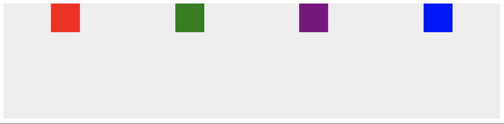

# Kahoot

1. Escolha a opção que corresponde à imagem



- ❌ `flex-end`
- ❌ `space-between`
- ✅ `space-around`
- ❌ `flex-start`

2. O valor de `space-between` pertence à propriedade `align-items`

- ❌ True
- ✅ False

3. Para que serve o `false` no código a seguir?

```js
document.getElementById("divContainer").addEventListener("click", function() {
  alert("child event");
}, false);
```

- ❌ O erro não deve ser `false`
- ✅ Permite pular a fase de captura
- ❌ Define a ordem do fluxo de eventos para iniciar a fase de captura
- ❌ Inicia a ordem de propagação

4. Onde o tipo de evento `change` não pode ser usado?

- ✅ `button`
- ❌ `input`
- ❌ `select`
- ❌ `textarea`

5. Podemos adicionar um evento de `submit` a um botão?

- ❌ True
- ✅ False

6. Representação do **documento** como um grupo de nós e objetos estruturados que possuem propriedades e métodos.

- ❌ body
- ❌ meta
- ✅ dom
- ❌ html

7. O que o `toggle` faz no código a seguir?

```js
divContainer.classList.toggle("visible");
```

- ❌ adicionar como seletor de tags a `"visible"`
- ❌ adicionar como uma classe filha para `"visible"`
- ❌ adiciona `"visible"` a todos os elementos filhos
- ✅ se `"visible"` existe, ele o exclui e se não o cria

8. Retorna uma **lista** de elementos que correspondem à seleção

- ✅ `querySelectorAll`
- ❌ `getElementsByTagName`
- ❌ `querySelector`
- ❌ `getElementsByClassName`

9. A variável `element` acessa o elemento pai de um nó?

```js
const divContainer = document.getElementById('someid');
const element = divContainer.childNodes;
```

- ❌ True
- ✅ False

10. Retorna `true` se o elemento contiver essa classe

- ❌ `classList.toggle`
- ❌ `classList.remove`
- ✅ `classList.contains`
- ❌ `classList.add`

↩️ [Voltar](../README.md)
