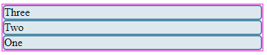
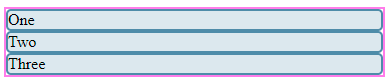
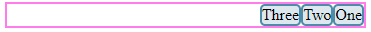
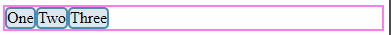

# Kahoot

1. Que resultado obtemos ao executar o seguinte código?

```html
<main class="box">
  <section>One</section>
  <section>Two</section>
  <section>Three</section>
</main>
<style>
  main {
    border: 2px solid violet;
    display: flex;
    flex-direction: row-reverse;
  }
</style>
```

- ❌ 
- ❌ 
- ✅ 
- ❌ 

2. `===` compara o tipo e o valor, sem fazer conversões enquanto o operador `==` converte e compara valores.

- ✅ True
- ❌ False

3. O que `console.log()` imprime?

```js
const ages = [32, 33, 16, 40];
const result = ages.filter(checkAdult);

function checkAdult(age) {
  return age >= 18;
}

console.log(result);
```

- ✅ `[32, 33, 40]`
- ❌ `results is not defined`
- ❌ `checkAdult is not defined`
- ❌ `[]`

4. `'olá ' + 'mundo'` é uma statement?

- ❌ True
- ✅ False

5. `a === 20 && b === 30` corresponde a uma expression?

- ✅ True
- ❌ False

6. Quantos e quais são os estados de uma promessa em JS?

- ❌ Dois: catch e try
- ❌ Dois: then e catch
- ❌ Três: comer, rezar e amar
- ✅ Três: pending, resolve e reject

7. Selecione o primitivo

- ❌ `NaN`
- ✅ `undefined`
- ❌ `{2}`
- ❌ `{"number":2}`

8. Que resultado obtemos ao executar o seguinte código?

```js
const arr = [1, 2, 3];
const newArr = [...arr];

arr.push(4);
newArr.push(5);

console.log(newArr);
```

- ❌ `[1, 2, 3, 4]`
- ✅ `[1, 2, 3, 5]`
- ❌ `[1, 2, 3, 4, 5]`
- ❌ `Error`

9. O que `console.log()` imprime?

```js
const getArr = (number = 1, ...num) => {
  console.log(num);
}

getArr(1, 2, 3, 4, 5, 6);
```

- ❌ `error`
- ❌ `1, 1, 2, 3, 4, 5, 6`
- ✅ `[2, 3, 4, 5, 6]`
- ❌ `[1, 2, 3, 4, 5, 6]`

10. O que `console.log()` imprime?

```js
const array1 = ['a', 'b', 'c'];
array1.forEach((element, i) => console.log(i));
```

- ❌ 'a', 'b', 'c'
- ❌ a, b, c, 0, 2, 3
- ❌ 1, 2, 3
- ✅ 0, 1, 2

↩️ [Voltar](../README.md)
